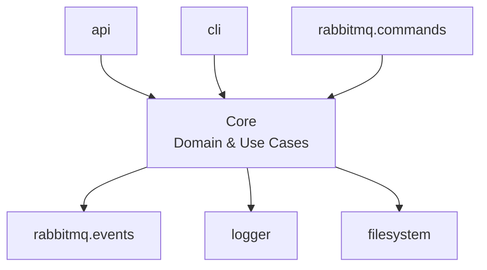
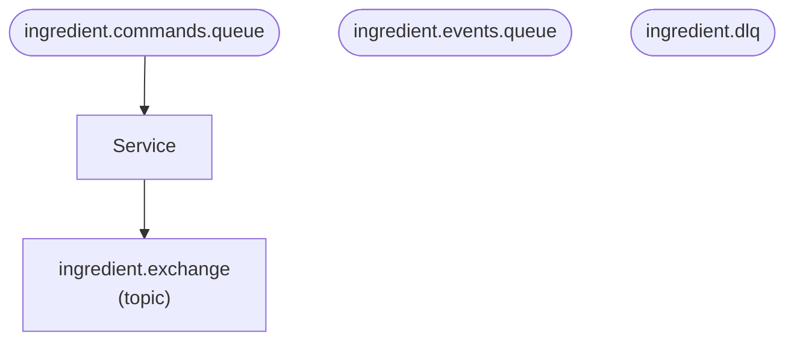

# Exemples de Diagrammes Générés

## Architecture Diagram (architecture.mmd)

Visualise l'architecture hexagonale avec les ports d'entrée et de sortie :



### Interprétation
- **Ports d'entrée (input)** : api, cli, rabbitmq.commands → pointent vers le Core
- **Ports de sortie (output)** : rabbitmq.events, logger, filesystem → le Core pointe vers eux
- **Core** : Contient la logique métier et les cas d'usage

---

## Messaging Diagram (messaging.mmd)

Visualise la configuration RabbitMQ avec les exchanges, queues et routing :



### Interprétation
- **Exchanges** : Rectangles avec le type (topic, direct, fanout, etc.)
- **Queues** : Formes arrondies
- **Flux** : 
  - Queues → Service : Le service consomme des commandes
  - Service → Exchanges : Le service publie des événements

---

## Comment visualiser ces diagrammes

### Option 1 : GitHub/GitLab
Les fichiers `.mmd` sont automatiquement rendus par GitHub et GitLab.

### Option 2 : Mermaid Live Editor
Copiez le contenu dans [Mermaid Live Editor](https://mermaid.live/)

### Option 3 : Extensions IDE
- **VSCode** : Extension "Markdown Preview Mermaid Support"
- **JetBrains** : Support natif dans les fichiers Markdown

### Option 4 : CLI
```bash
# Installer mermaid-cli
npm install -g @mermaid-js/mermaid-cli

# Générer des images PNG
mmdc -i diagrams/architecture.mmd -o diagrams/architecture.png
mmdc -i diagrams/messaging.mmd -o diagrams/messaging.png
```
